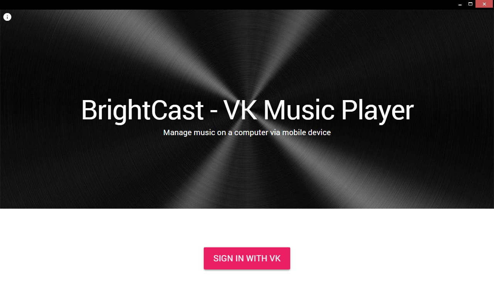
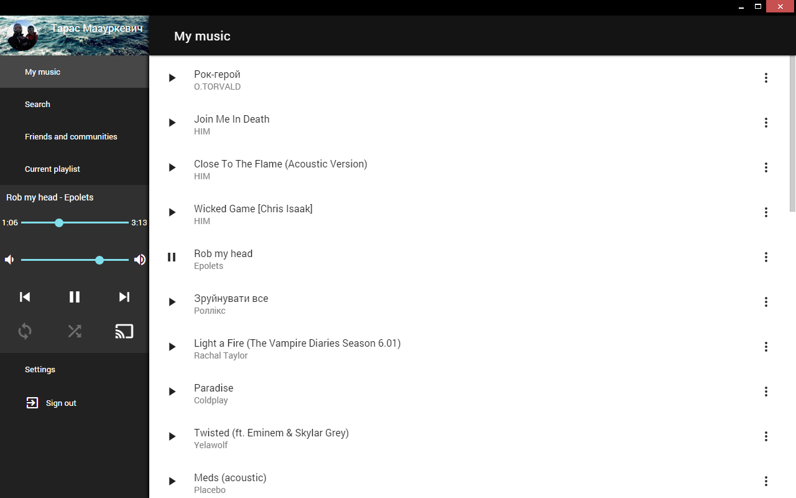
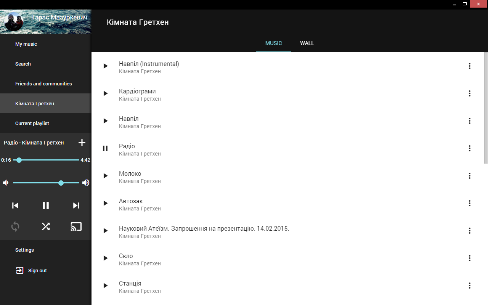
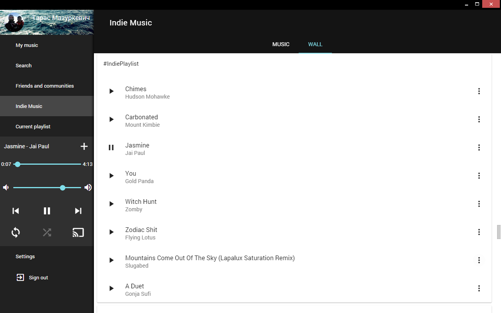
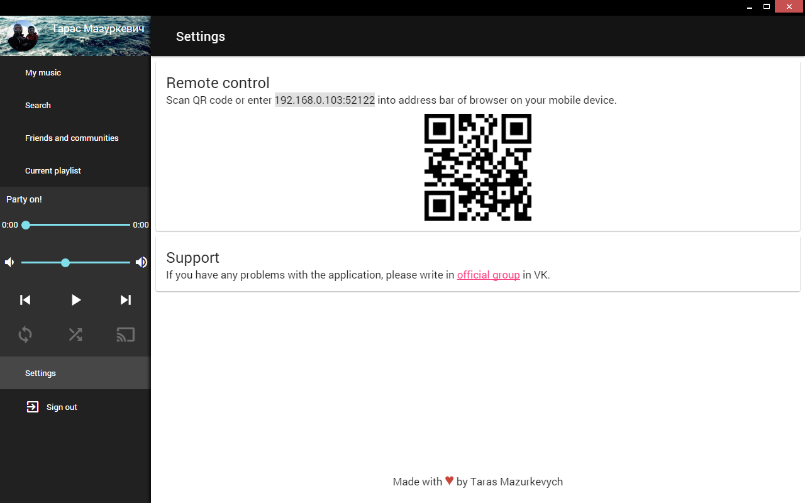

# BrightCast - VK Music Player

## Development

Install dependencies via `npm install`

Install Chrome Apps & Extensions Developer Tool https://goo.gl/vuvvDy

When staring developement run `gulp`

Build a production version `gulp release_prod`
